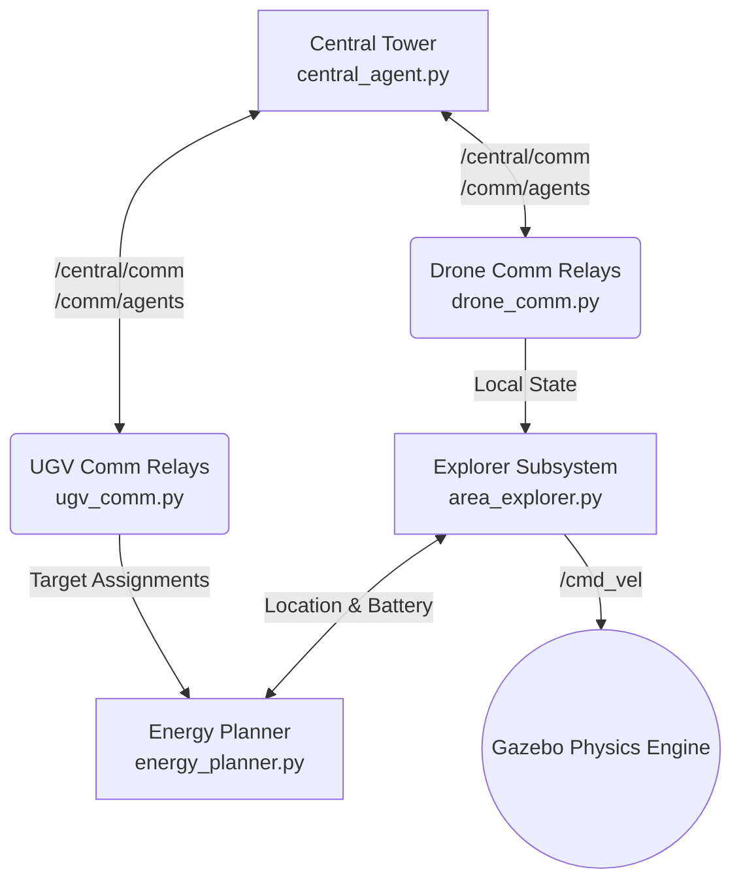

# Codebase & API Reference

This document serves as a technical breakdown of the Multi-Drone Agricultural Monitoring System. It maps out the ROS network architecture, details the core Python modules, and documents the Primary API classes. This guide is intended for developers, researchers, or reviewers trying to understand how the system is wired together under the hood.

---

## 1. System Architecture Map

The system relies on a heavily decoupled ROS distributed architecture ensuring that Drones, Mobile Chargers (UGVs), and the Central Tower interact asynchronously.

---

## 2. Core Operational Nodes

### `area_explorer.py` (Main Executive)
The brain of the operation for individual drone autonomy. This node launches the individual mission controllers and integrates the deep learning models.

*   **`class DroneExplorer`**
    *   *Purpose:* Handles the state-machine for an individual drone (Hovering, Scanning, Correcting).
    *   *Key Methods:*
        *   `explore()`: The main PID flight control loop to intercept Voronoi waypoints. Calculates the physical pitch/roll commands and applies rotation matrices based on Yaw.
        *   `start_scanning()`: Triggers a 1-second holding pattern to "scan" a target.
        *   `force_mark_visited()`: Formally registers a captured point in the algorithm grid and increments coverage math.
*   **`class BackupDrone`**
    *   *Purpose:* Operates uniquely on a background thread. Instructs reserve drones to hold their Spawn XYZ coordinates until physically deployed.
*   **`class Battery`**
    *   *Purpose:* Simulates non-linear lithium-polymer discharge rates and listens to `/drone_X/charge_cmd` for instant 100% replenishments.

### `algo3_sim.py` (Swarm Navigation Logic)
Manages the cooperative routing based on the *GOMWC + LERR + Shake* algorithm, running across a unified 21.5 × 21.5 m workspace.

*   **`class Algo3Hybrid`**
    *   *Purpose:* The central "Oracle" that assigns targets to active drones while actively calculating repulsion metrics to spread the drones outwards.
    *   *Key Methods:*
        *   `step()`: Executes a single optimization frame. Evaluates the closest unvisited targets against the LERR (Local Energy Risk Reduction) repulsion penalties.
        *   `update_active_drones(new_active_list)`: Called during hardware failure or reserve deployment to dynamically restructure Voronoi sectors instantly.
        *   `_calculate_voronoi_distances()`: Calculates Euclidean distance arrays for all active drones to dynamically allocate sectors.

### `central_agent.py` (Fleet Coordination)
The centralized server simulating network constraints, delay, and dispatching.

*   **`class CentralAgent`**
    *   *Purpose:* Implements the 3-Way Handshake protocol and tracks missing units.
    *   *ROS Topics:* Publishes `HELLO` broadcasts on `/central/comm`.
    *   *Heartbeat Engine:* `broadcast_hello()` systematically loops every 10 seconds. Validates timestamps from connected agents. If an agent goes `> 15.0s` without an ACK, it securely fires a `DEPLOY_RESERVE` command into the control queue.

---

## 3. Machine Learning & Inference

### `drought_probability_model.py`
Connects the simulation to real-world meteorological data models.

*   **`class DroughtLSTM(nn.Module)`**
    *   *Purpose:* PyTorch neural architecture definition mapping a `[1, 90, 6]` tensor into a single linear probability integer.
*   **`class DroughtProbabilityModel`**
    *   *Purpose:* Wrapper that safely manages filesystem loading and inference.
    *   *Key Methods:*
        *   `predict_from_csv(csv_path)`: High-fidelity inference using 2GB source data.
        *   `predict_from_reference_sequence()`: Portable, fallback inference. Automatically called if the source CSV is missing, evaluating predictions from `LSTM/reference_sequence.npy` to ensure the program never natively crashes on new branches.

---

## 4. Energy & Ground Operations

### `energy_planner.py`
Calculates optimal rescue solutions for drones running out of battery, coordinating the mobile ground units (UGVs).

*   **`class EnergyAwarePlanner`**
    *   *Purpose:* Evaluates all drone batteries dynamically. Drones below 30% are injected into a high-priority rescue queue.
    *   *Key Methods:*
        *   `dijkstra(start, goal)`: Executes physical 2.0m-grid pathfinding to route the UGV through the field toward the distressed drone.
        *   `assign_targets()`: Resolves deadlocks to ensure two discrete UGVs do not chase the same drone simultaneously.

### `ugv_manager.py`
Maps physical constraints to the ground vehicles.

*   **`class UGVController`**
    *   *Purpose:* Executes the Dijkstra-calculated routes at the motor level. Maintains perimeter patrol operations when idle, and handles proximity charging handshakes (`/charge_cmd`) when `< 2.0` meters from target drones.

---

## 5. Peer-to-Peer Inter-Drone Systems

### Hardware Failure Matrix (Ad-Hoc Network)
The system incorporates distinct failure emulation to validate swarm robustness:
*   *Trigger mechanism:* Emulated at randomized coverage milestones inside `area_explorer.py`.
*   *SOS Handshake:* `is_dead` flag is tripped. The drone broadcasts a localized SOS P2P metric so that neighbors (`Algo3Hybrid`) absorb the dead drone's physical space natively, bypassing the sluggish Central Tower TCP loop.
*   *Physical shutdown:* Drone logic forcefully publishes absolute `0.0` vectors to `/cmd_vel` and a manual SDF `SetModelState` teleports the wreckage out of Gazebo physics bounds to prevent UGV target collisions.

---

## 6. Simulation & File Map

*   `launch/explore_areas.launch` → Master entry point. Binds all python modules. Utilizes the `required="true"` hook on the area explorer to intercept mission completion flags and systematically cleanly tear down the ROS core.
*   `config/areas.yaml` → Global variable matrix controlling battery limits, UGV sizing, drone spawn radiuses, and default meteorological baselines.
*   `worlds/field_areas.world` → Standard Gazebo 11 `.world` environment embedding the unified collision meshes, sun geometry, and origin vectors.
